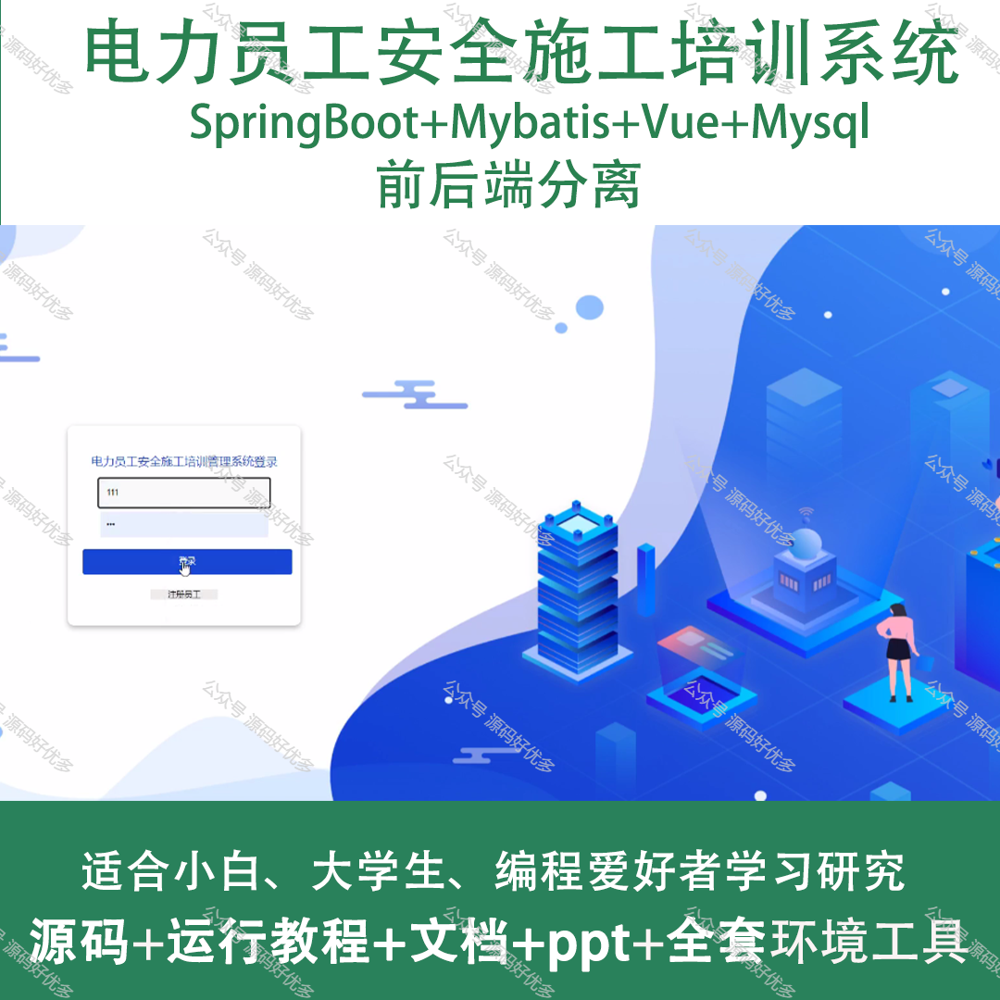
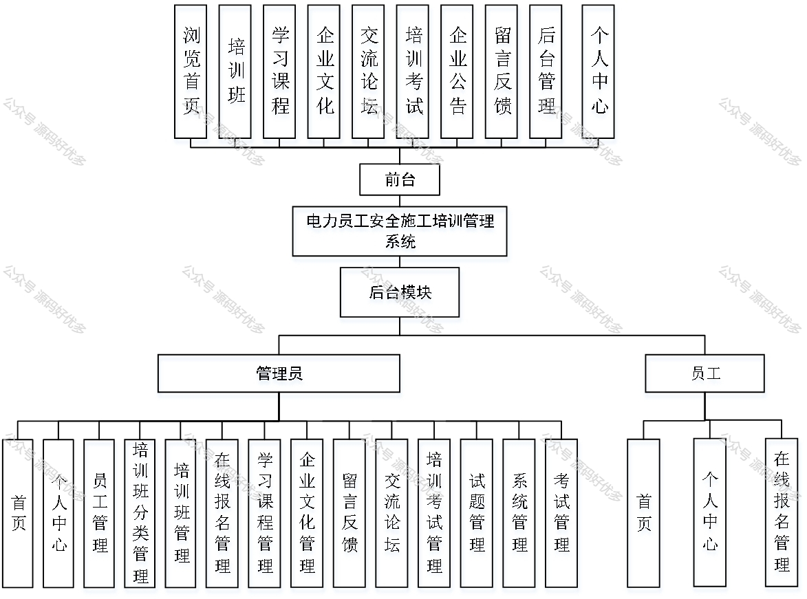
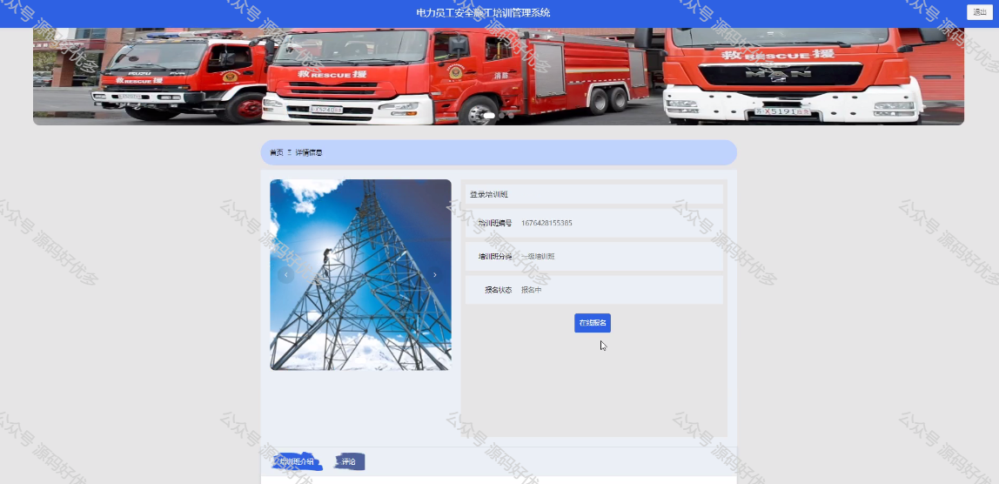
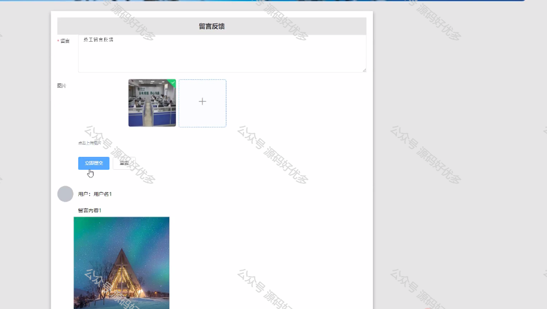
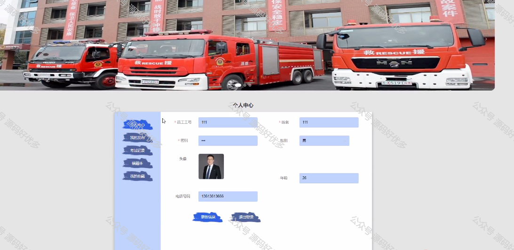
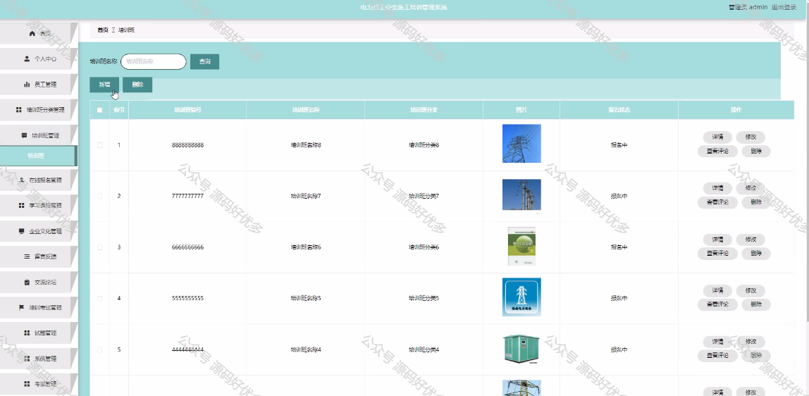
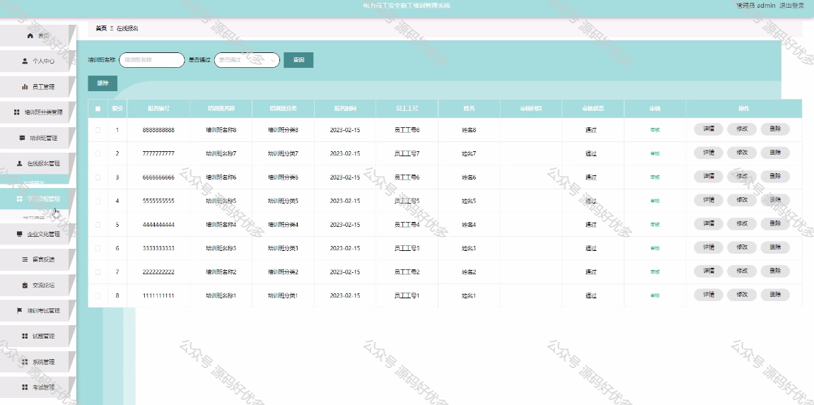
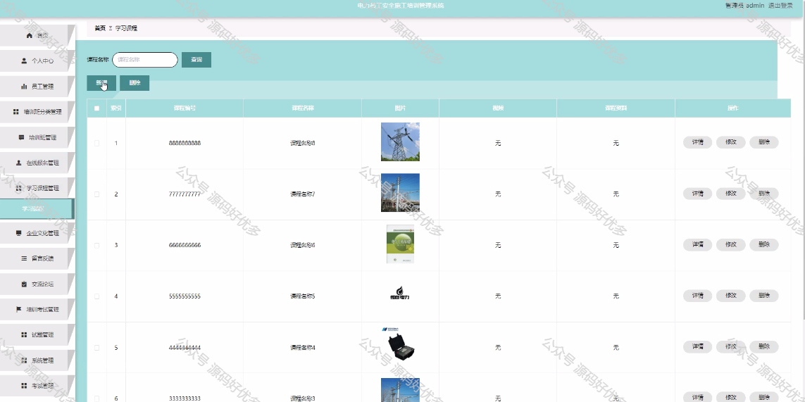
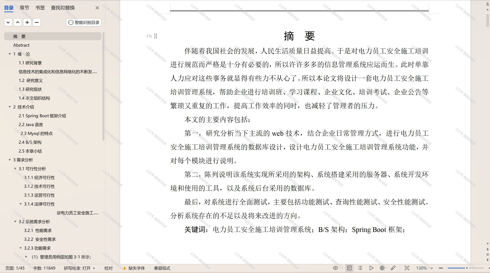

 
## 查看主页获取源码

> **作者介绍**： **✌**全网粉丝10W+本平台特邀作者、博客专家、CSDN新星计划导师、java领域优质创作者,博客之星、掘金/华为云/阿里云/InfoQ等平台优质作者、专注于项目实战 **✌**

  

### 一、作品包含

源码+数据库+设计文档万字+PPT+全套环境和工具资源+部署教程

### 二、项目技术

前端技术：Html、Css、Js、Vue、Element-ui

数据库：MySQL

后端技术：Java、Spring Boot、MyBatis

  

### 三、运行环境

开发工具：IDEA/eclipse

数据库：MySQL5.7

数据库管理工具：Navicat10以上版本

环境配置软件： JDK1.8+Maven3.6.3

前端Nodejs：14

### 四、项目介绍
项目编号：springbootA144

电力员工安全施工培训管理系统是为了确保电力行业施工人员的安全操作技能和事故预防意识，通过专业的培训与管理，降低施工过程中的安全风险而设计的信息化平台。该系统集成了课程学习、实操考核、安全知识普及、事故案例分析等功能，旨在提升员工的安全素养，保障电力工程施工的安全顺利进行，为电力企业的可持续发展提供坚实的人力资源保障。

前台员工功能：浏览首页、培训班、学习课程、企业文化、交流论坛、培训考试、企业公告、留言反馈、后台管理、个人中心。

后台分为管理员和员工
管理员的功能：首页、个人中心、员工管理、培训班分类管理、培训班管理、在线报名管理、学习课程管理、企业文化管理、留言反馈、交流论坛、培训考试管理、试题管理、系统管理和考试管理。
员工的功能：首页、个人中心、在线报名管理。

### 五、运行截图

  
